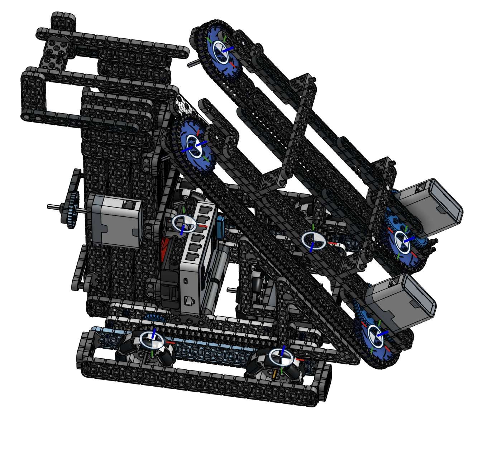

SALEEL KHISTI

 Student engineer • Web Developer • Designer

I am a student engineer dedicated to finding and solving real world problems in my community. 

Skills:

  <ul>
    <li>Python</li>
    <li>HTML/CSS/JavaScript</li>
    <li>CAD/Onshape</li>
    <li>Robotics</li>
    <li>Git/github</li>
  </ul>

Projects:

Khisti Dental Center Website (In development)
 
  

VEX IQ Robotics CAD

  
  

Achievements:

  <ul>
    <li>Henrico Innovation Challenge</li>
    <li>Innovate Award Robotics</li>
  </ul>

Projects:

  <ul>
    <li>Currently Developing Khisti Dental Center Website</li>
    <li>Taugh 5+ kids in local area coding fundamentals through Apex Code</li>
    <li>Computer Aided Designs for Robot Mechanics</li>
  </ul>

Examples:

